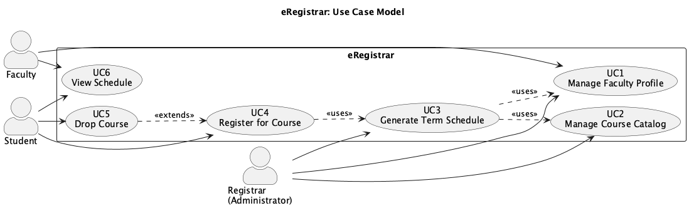

# System Requirements Specification: eRegistrar

**Course:** CS425, Software Engineering  
**Student:** Ziad El Fatih, 618971  
**Project repository:** `https://github.com/ElfatihZiad/eregistrar`  

---

## 1. Introduction

This document specifies the requirements for **eRegistrar**, a web-based course
scheduling and registration system for the Computer Science department. It
covers the use-case model (actors, use-case diagram, and descriptions of the
major use cases) along with the non-functional requirements.

It follows from the [Vision Document](../Lab1_Vision/eRegistrar_Vision_Document.md)
and feeds into the architecture (Lab 3) and use-case analysis (Labs 4 and 5).

**In scope:** faculty profiles, course catalog, schedule generation, and
student registration. **Out of scope:** admissions, grading, tuition, and room
allocation. Those stay with the university's existing student information
system.

### Definitions

| Term | Meaning |
|---|---|
| **Block** | An 8-week teaching period; a course is taught within one block. |
| **Entry** | An intake cohort of students; the department runs four per year. |
| **Section** | A specific offering of a course in a block, with an assigned faculty member and a capacity. |
| **Schedule** | The set of sections offered in a term, in draft or published state. |

## 2. Actors

| Actor | Description |
|---|---|
| **Student** | Registers for and drops courses; views the published schedule. |
| **Faculty** | Maintains their profile (specializations, teachable courses, block availability) and views assigned sections. |
| **Registrar (Administrator)** | Maintains the catalog, generates and publishes the schedule, assigns faculty. |

## 3. Use-Case Model

| ID | Use Case | Primary Actor | Feature | Description |
|---|---|---|---|---|
| UC1 | Manage Faculty Profile | Faculty | F1 | Create, view and update a faculty profile: specializations, teachable courses, block availability. |
| UC2 | Manage Course Catalog | Registrar | F2 | CRUD for courses, prerequisites and program requirements. |
| UC3 | Generate Term Schedule | Registrar | F3, F4 | Build a draft schedule of sections for a term and assign qualified, available faculty. **Described in full below.** |
| UC4 | Register for Course | Student | F5, F6 | Register for a section of a published schedule, subject to the registration rules. **Described in full below.** |
| UC5 | Drop Course | Student | F5 | Drop a registration within the registration window, releasing the seat. |
| UC6 | View Schedule | Student, Faculty | F7 | View the published schedule: a student's own registrations, or a faculty member's assigned sections. |

UC3 and UC4 are the architecturally significant use cases, and they're the
ones carried into the sequence, collaboration and VOPC diagrams of Labs 4 and 5.

---

## 4. Use-Case Descriptions

### UC3: Generate Term Schedule

| | |
|---|---|
| **Use Case Number** | 3 |
| **Name** | Generate Term Schedule |
| **Brief description** | The registrar generates a draft schedule for a term. The system creates a section for each course required by the active entries and assigns a qualified, available faculty member to each, reporting any course it couldn't staff. |
| **Actors** | Registrar |
| **Preconditions** | The registrar is logged in. The term, its blocks and entries are defined, the course catalog is populated (UC2), and at least one faculty profile exists (UC1). |

**Basic Flow**

| Step | User Actions | System Actions |
|---|---|---|
| 1 | The registrar selects "Generate schedule" and chooses a term. | The system displays the generation form with the term's blocks and active entries. |
| 2 | The registrar confirms and requests generation. | The system determines the courses required by each entry in each block, placing 400-level prerequisite courses in earlier blocks and 500-level courses in later blocks. |
| 3 | N/A | For each required course the system creates a section and selects a faculty member who lists the course as teachable, is available in that block, and isn't already assigned to another section in that block. |
| 4 | N/A | The system saves the result as a **draft** schedule and displays it, along with any courses it couldn't staff. |

**Alternate Flows**

- **A1: No qualified faculty available.** The section is created unassigned and the course is added to the unstaffed list. Generation continues.
- **A2: Schedule already exists.** The registrar has to choose explicitly between discarding the existing draft and cancelling. A published schedule is never overwritten.

| | |
|---|---|
| **Postconditions** | A draft schedule exists for the term. Nothing is visible to students until it's published. |
| **Business Rules** | **BR3:** A faculty member may not be assigned to two sections in the same block. **BR4:** A faculty member may only be assigned to a course listed as teachable in their profile. **BR5:** 400-level prerequisite courses are scheduled in earlier blocks than the 500-level courses that depend on them. |

---

### UC4: Register for Course

| | |
|---|---|
| **Use Case Number** | 4 |
| **Name** | Register for Course |
| **Brief description** | A student registers for a section of a published schedule. The system accepts the registration only if the prerequisite, capacity, time-conflict and course-load rules are all satisfied. |
| **Actors** | Student |
| **Preconditions** | The student is logged in. A schedule is published for the term and the registration window is open. |

**Basic Flow**

| Step | User Actions | System Actions |
|---|---|---|
| 1 | The student opens "Register" for the term. | The system displays the published schedule for the student's entry, with the assigned faculty and the remaining seats for each section. |
| 2 | The student selects a section and confirms. | The system validates the registration: prerequisites completed, a seat available, no time conflict in that block, and course load within the student's limit. |
| 3 | N/A | If every rule passes, the system creates the registration, reduces the available seats by one in the same transaction, and displays a confirmation with the updated schedule. |

**Alternate Flows**

- **A1: Prerequisite not met.** The registration is refused and the missing prerequisite is named.
- **A2: Section full.** The registration is refused, including when the last seat is taken by another student between display and confirmation.
- **A3: Time conflict.** The registration is refused and the conflicting section is identified.
- **A4: Course load exceeded.** The registration is refused and the limit is stated.

In every alternate flow the transaction is rolled back. No registration is
created and no seat is consumed.

| | |
|---|---|
| **Postconditions** | Either the registration exists and the section has one fewer seat, or nothing changed and the student has been told why. |
| **Business Rules** | **BR6:** All prerequisites must be completed before registering. **BR7:** Registrations may never exceed a section's capacity. **BR8:** A student may not hold two registrations at overlapping times in the same block. **BR9:** Course load per block is limited by student category. |

---

## 5. Non-Functional Requirements

| ID | Requirement |
|---|---|
| NFR1 | Schedule and registration pages respond within 2 seconds under normal load. |
| NFR2 | 150 concurrent users are supported during a registration window. |
| NFR3 | Section capacity is enforced correctly under concurrent registration. The last seat is granted to exactly one student. |
| NFR4 | Every operation is authorized by role; a student may access only their own registrations. |
| NFR5 | Student pages are usable at 375 px width; all traffic uses TLS. |
| NFR6 | The system runs on any platform with a Java 11+ runtime and a relational database. |

## 6. Traceability: Features to Use Cases

| Vision feature | Use cases |
|---|---|
| F1 Faculty Profile Management | UC1 |
| F2 Course & Program Catalog | UC2 |
| F3 Schedule Generation | UC3 |
| F4 Faculty Assignment & Conflict Detection | UC3 |
| F5 Online Student Registration | UC4, UC5 |
| F6 Registration Rule Enforcement | UC4, UC5 |
| F7 Schedule & Enrolment Views | UC6 |
| F8 Authentication & Role-Based Access | all |
