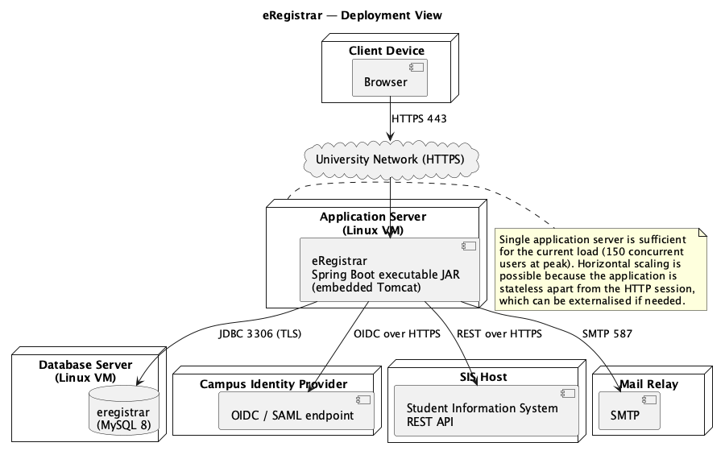

# Architectural Analysis and Initial System Architecture — **eRegistrar**

**Course:** CS425 — Software Engineering
**Author:** Ziad El Fatih — 618971
**Document version:** 1.0 (first iteration)
**Date:** August 3, 2026

Inputs: [Vision Document](../Lab1_Vision/eRegistrar_Vision_Document.md) (Lab 1)
and [SRS](../Lab2_SRS/eRegistrar_SRS.md) (Lab 2).

---

## 1. Purpose

This document records the first iteration of architectural analysis for
eRegistrar and presents the resulting high-level system architecture. It states
the constraints and quality attributes that drive the architecture, evaluates
the candidate architectural styles against them, and describes the chosen
solution as a layered architecture with a subsystem decomposition, a deployment
view, and the key mechanisms that cut across the system.

## 2. Architectural Constraints

| # | Constraint | Source |
|---|---|---|
| C1 | Browser-only client; no software may be installed on user machines | Vision §3.2 (User Environment) |
| C2 | Java technology stack (Java 11+, Spring Boot), which is also the stack taught in the course and used in Labs 6–7 | Course/technology decision, Vision §5 |
| C3 | Relational database; the data is highly structured and relational (courses, prerequisites, sections, registrations) | Vision §5 |
| C4 | Authentication must be delegated to the existing campus identity provider — the application may not manage production passwords | NFR6 |
| C5 | The SIS remains the system of record for student and program data; eRegistrar integrates rather than replaces | Vision §4.1 |
| C6 | Small team (student project) and a fixed course timeline — the architecture must be buildable and demonstrable within the term | Project constraint |
| C7 | University-hosted infrastructure, modest hardware budget: a single application server and a single database server | Vision §4.2 |
| C8 | Student data is subject to FERPA | NFR10 |

## 3. Architecturally Significant Requirements

The quality attributes that actually shape the architecture, rather than all
twelve NFRs:

| Quality attribute | Requirement | Architectural implication |
|---|---|---|
| **Concurrency / data integrity** | Section capacity must hold under simultaneous registration; the last seat goes to exactly one student (NFR3, BR12) | Registration must be a transactional server-side operation with pessimistic or optimistic locking on the section row. Rules cannot be enforced in the browser. |
| **Peak load** | 150 concurrent users concentrated in the first minutes of a registration window (NFR2) | Stateless application tier so more instances can be added; connection pooling; short transactions. |
| **Security & privacy** | Role-based authorization on every operation, FERPA (NFR5, NFR10, C8) | A single security mechanism applied at the presentation boundary and re-checked in the business layer; no direct client access to the data layer. |
| **Modifiability** | The scheduling and registration rules are the volatile part of the system (NFR12) | Business rules isolated in the business layer, expressed against a domain model that does not depend on the web or persistence frameworks. |
| **Integrability** | IdP and SIS are external and out of our control (C4, C5) | Integration behind adapter interfaces so external systems can be stubbed during development and swapped later. |
| **Usability across devices** | Student pages usable at 375 px (NFR7) | Server-rendered responsive pages; no dependence on a heavy client framework. |

## 4. Candidate Architectures Considered

| Candidate | Fit | Decision |
|---|---|---|
| **Two-tier client/server** (fat client talking directly to the database) | Fails C1 (installed client) and NFR5 (database credentials on the client). Business rules would be duplicated per client. | **Rejected** |
| **Monolithic single-layer web app** (rules embedded in the pages/controllers) | Fastest to build (C6), but the scheduling and registration rules — the volatile, high-value part — would be scattered through the presentation code, failing NFR12. | **Rejected** |
| **Microservices** (separate deployable services per subsystem) | Independent scaling and deployment, but it multiplies operational cost, introduces distributed transactions across the capacity check (a direct threat to NFR3), and cannot be built and demonstrated by a small team within the term (C6, C7). | **Rejected for this iteration** |
| **Layered (n-tier) web architecture with a modular business layer** | Satisfies C1–C3 directly, isolates the volatile rules for NFR12, keeps registration inside a single local transaction for NFR3, and is deployable on one server (C7). Subsystem boundaries within the business layer leave the door open to extracting services later. | **Selected** |
| **Event-driven / message-based backbone** | Attractive for schedule-change propagation and SIS synchronisation, but unnecessary for the core flows and adds a broker to operate (C7). | **Deferred** — notification is behind a service interface so it can become asynchronous later without touching callers. |

## 5. Selected Architecture

### 5.1 Overview

A **four-layer server-side web architecture**: Presentation, Business (organised
into subsystems), Domain Model, and Data Access — with external systems reached
through adapters. Dependencies point downwards only; no layer may call upwards.

*Source: [diagrams/architecture_layers.puml](diagrams/architecture_layers.puml)*

### 5.2 Layer Responsibilities

| Layer | Responsibility | Key elements |
|---|---|---|
| **Client tier** | Renders HTML, submits forms. No business logic and no trust. | Browser (desktop and mobile) |
| **Presentation** | HTTP handling, request validation, view rendering, authentication and role checks, JSON API. | Spring MVC controllers, Thymeleaf views, REST endpoints, Spring Security |
| **Business** | All business rules and transaction boundaries, organised into subsystems that each own a coherent slice of behaviour. | Faculty Profile, Course & Program Catalog, Scheduling, Registration, Notification |
| **Domain model** | The concepts and invariants of the problem — independent of web and persistence frameworks. | Faculty, Course, Section, Student, Registration, Schedule, Block, Entry |
| **Data access** | Persistence and queries; the only layer that knows SQL. | Spring Data JPA repositories, relational database |
| **External** | Systems outside our control, reached through adapter interfaces. | Campus IdP (OIDC), SIS (REST), SMTP gateway |

### 5.3 Subsystem Decomposition

| Subsystem | Owns | Provides (interface) | Depends on |
|---|---|---|---|
| **Faculty Profile** | Faculty profiles, specializations, teachable courses, block availability | `FacultyService` — CRUD, qualification and availability queries | Domain, repositories |
| **Course & Program Catalog** | Courses, prerequisites, programs, entries, blocks | `CatalogService` — CRUD, prerequisite lookup, program requirements | Domain, repositories |
| **Scheduling** | Schedules, sections, faculty assignment, conflict detection, publication | `ScheduleService` — generate, assign, publish | Faculty Profile, Catalog, Notification |
| **Registration** | Registrations, rule validation, seat management | `RegistrationService` — register, drop, list | Catalog, Scheduling, Notification |
| **Notification** | Outbound notification of affected users | `NotificationService` — notify(recipients, event) | SMTP adapter |

The dependency graph is acyclic: Registration → Scheduling → {Faculty Profile,
Catalog}, with Notification a leaf. This is what makes the subsystems separately
testable, and it is the boundary along which services could later be extracted
if the microservice option is revisited.

### 5.4 Deployment View

*Source: [diagrams/deployment.puml](diagrams/deployment.puml)*

One application server running the Spring Boot executable JAR with embedded
Tomcat, one database server, and three external endpoints. The application tier
holds no state beyond the HTTP session, so a second instance behind a load
balancer is the scaling path if peak load grows beyond NFR2.

## 6. Key Architectural Mechanisms

| Mechanism | Approach |
|---|---|
| **Persistence** | JPA/Hibernate with Spring Data repositories; schema managed by migration scripts (Flyway). |
| **Transaction management** | Declarative (`@Transactional`) at the business-service boundary. One registration = one transaction. |
| **Concurrency control** | Optimistic locking (`@Version`) on `Section`; the seat decrement and the registration insert occur in the same transaction, so a lost update forces a retry rather than an over-filled section (NFR3, BR12). |
| **Authentication / authorization** | OIDC single sign-on against the campus IdP; roles Admin/Faculty/Student mapped from IdP claims; method-level authorization re-checked in the business layer so the rules do not depend on the UI. |
| **Validation** | Bean Validation for format-level input checks in the presentation layer; business rules (prerequisites, capacity, conflicts, load limits) enforced only in the business layer. |
| **Error handling** | Business rule violations raised as typed domain exceptions, translated once at the presentation boundary into user-facing messages and HTTP status codes. |
| **Auditing** | Registration transactions, schedule publications and qualification overrides written to an append-only audit table with actor and timestamp (NFR9, F10). |
| **External integration** | IdP, SIS and SMTP behind adapter interfaces, with in-memory stubs used in development and testing (C5). |
| **Notification** | Synchronous behind `NotificationService` in this iteration; the interface permits an asynchronous queue-backed implementation later without changing callers. |

## 7. Risks and Next Iteration

| # | Risk | Mitigation / next step |
|---|---|---|
| R1 | Schedule generation may be computationally awkward as constraints multiply (faculty availability, prerequisites, capacity, block placement) | Iteration 1 uses a greedy assignment with explicit reporting of unstaffed courses; measure on realistic data before considering a constraint solver. |
| R2 | Registration peak load contends on popular sections | Optimistic locking plus short transactions; load-test the registration path against NFR2 before the registration window is first used. |
| R3 | SIS integration details are not yet known | Adapter interface with a stub implementation; the schedule and registration flows are demonstrable without the real SIS. |
| R4 | Business rules (course load per student category) may change per policy | Rules kept in the business layer with automated tests; parameterised limits held as configuration rather than code constants. |

**Next iteration.** Detail the use-case realisations for the significant use
cases — sequence diagrams in Lab 4, collaboration and VOPC diagrams in Lab 5 —
and refine the domain model into a design-level class diagram.
