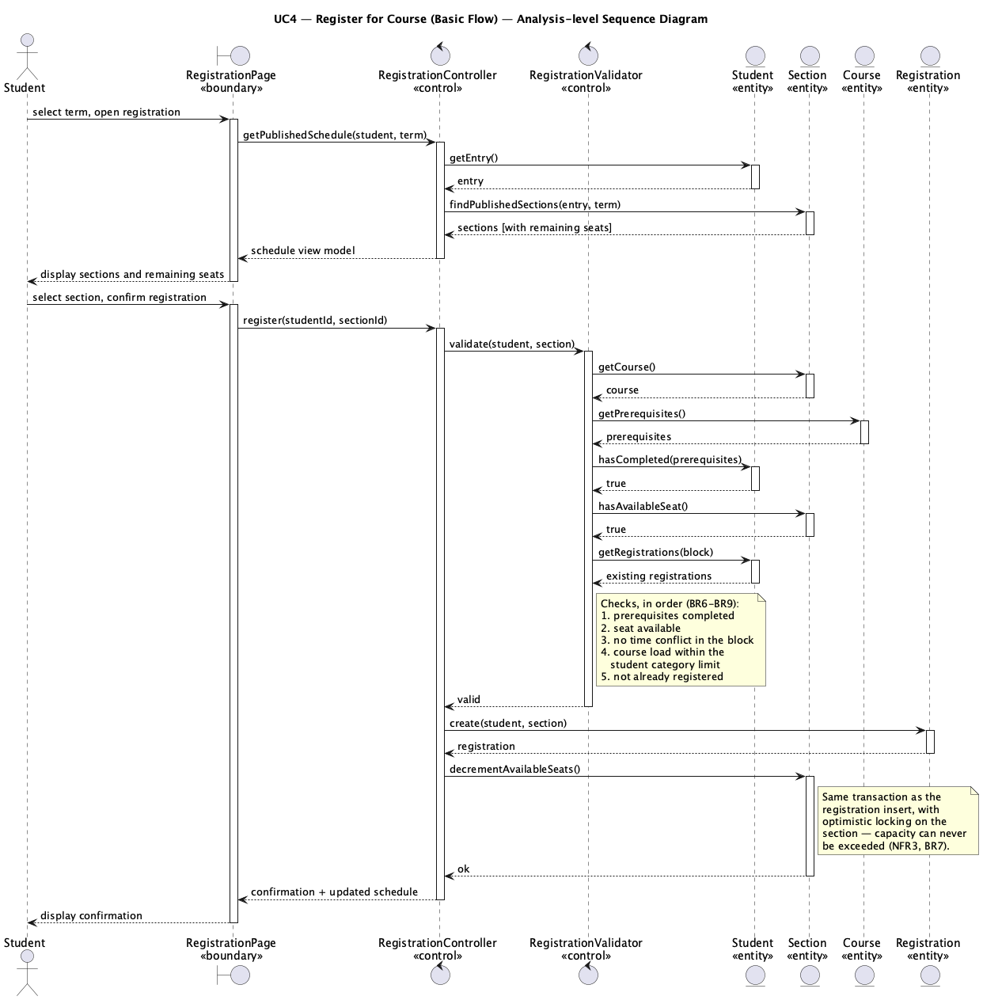
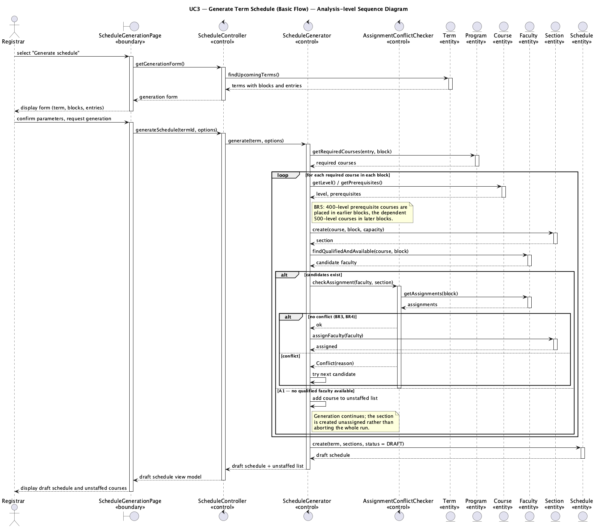

# Lab 4 — Sequence Diagrams

**Project:** eRegistrar  
**Student:** Ziad El Fatih — 618971  

Sequence diagrams for the two major use cases of the
[SRS](../Lab2_SRS/eRegistrar_SRS.md), drawn at the analysis level: every
lifeline is stereotyped as **«boundary»**, **«control»** or **«entity»**, and
messages flow actor → boundary → control → entity, never back up.

| Stereotype | Role |
|---|---|
| **«boundary»** | Mediates between an actor and the system; holds no business rules. |
| **«control»** | Coordinates the use case and applies the business rules. |
| **«entity»** | Long-lived stored information. |

---

## UC4 — Register for Course



| Class | Stereotype | Responsibility |
|---|---|---|
| `RegistrationPage` | boundary | Shows the schedule with remaining seats; collects the student's selection. |
| `RegistrationController` | control | Coordinates the use case; owns the transaction boundary. |
| `RegistrationValidator` | control | Applies BR6–BR9: prerequisites, capacity, time conflict, course load. |
| `Student`, `Section`, `Course`, `Registration` | entity | The registration data. |

The key detail is that the seat check and the seat decrement happen in the same
transaction on `Section`, under optimistic locking — this is what makes NFR3
(capacity holds under concurrent registration) achievable.

## UC3 — Generate Term Schedule



| Class | Stereotype | Responsibility |
|---|---|---|
| `ScheduleGenerationPage` | boundary | Generation form; displays the draft schedule and unstaffed courses. |
| `ScheduleController` | control | Coordinates the use case. |
| `ScheduleGenerator` | control | Determines required courses, creates sections, selects faculty (BR5). |
| `AssignmentConflictChecker` | control | Enforces BR3 (no double booking) and BR4 (only teachable courses). |
| `Term`, `Program`, `Course`, `Faculty`, `Section`, `Schedule` | entity | The scheduling data. |

Alternate flow A1 is visible in the diagram: when no qualified, available
faculty member exists, the section is created unassigned and the course is added
to the unstaffed list rather than aborting the run.

## Re-rendering

```bash
java -jar tools/plantuml.jar -tpng Lab4_SequenceDiagrams/diagrams/*.puml
```
