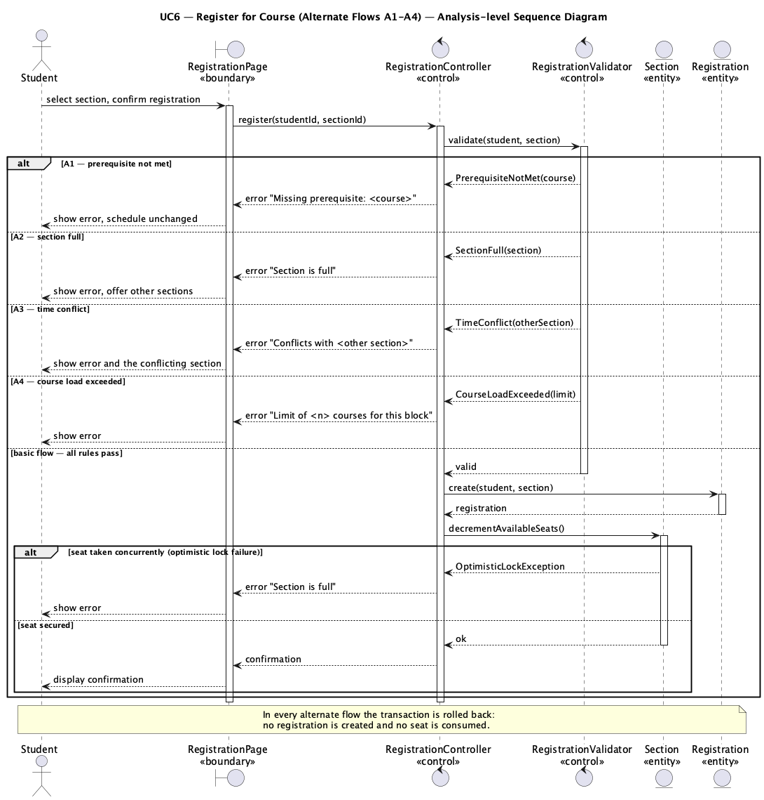
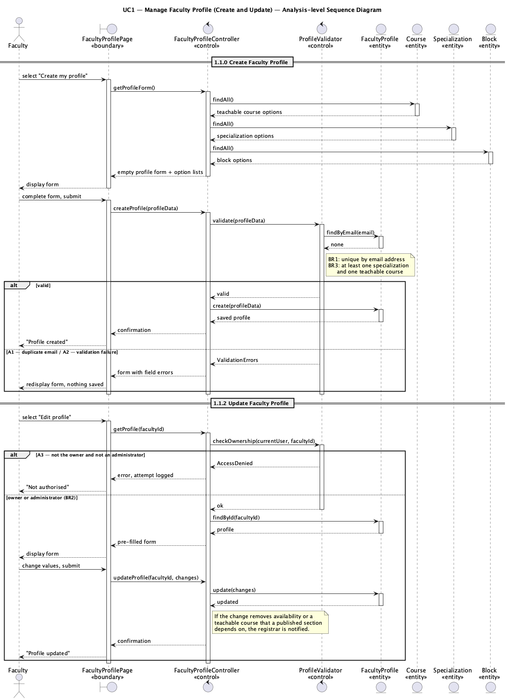

# Lab 4 — Use-Case Analysis: Sequence Diagrams

**Project:** eRegistrar
**Author:** Ziad El Fatih — 618971
**Date:** August 3, 2026

Sequence diagrams for the significant use cases of the
[SRS](../Lab2_SRS/eRegistrar_SRS.md), drawn at the **analysis level**: every
lifeline is an analysis class stereotyped as **boundary**, **control** or
**entity**, following the Lesson 7 guidelines.

## Analysis class stereotypes used

| Stereotype | Role | Rule applied here |
|---|---|---|
| **«boundary»** | Mediates between an actor and the system — one boundary class per actor/use-case pair. | Only boundary classes talk to actors; they hold no business rules. |
| **«control»** | Coordinates the flow of a use case and applies the business rules. | One primary control class per use case, plus a dedicated validator/checker control where the rule set is substantial enough to be worth isolating. |
| **«entity»** | Long-lived information the system stores. | Entities respond to queries and state changes; they never call boundary or control classes. |

Direction of messages is always actor → boundary → control → entity, and never
entity → control.

## Diagrams

### 1. UC6 — Register for Course (basic flow)


*Source: [sd_uc6_register_for_course.puml](diagrams/sd_uc6_register_for_course.puml)*

| Class | Stereotype | Responsibility |
|---|---|---|
| `RegistrationPage` | boundary | Displays the published schedule with remaining seats; collects the student's selection. |
| `RegistrationController` | control | Coordinates the use case; owns the transaction boundary for the registration. |
| `RegistrationValidator` | control | Applies BR11–BR15: prerequisites, capacity, time conflict, course load, duplicate registration. |
| `Student` | entity | Entry, completed courses, existing registrations. |
| `Section` | entity | Course, block, capacity and remaining seats; the seat decrement happens here. |
| `Course` | entity | Level and prerequisites. |
| `Registration` | entity | The created association of student to section. |

The critical detail is that the seat check and the seat decrement live in the
same transaction on `Section`, under optimistic locking — this is what makes
NFR3 (capacity holds under concurrent registration) achievable.

### 2. UC6 — Register for Course (alternate flows A1–A4)


*Source: [sd_uc6_register_alternate_flows.puml](diagrams/sd_uc6_register_alternate_flows.puml)*

Each rule violation returns a typed failure from the validator; in every case
the transaction is rolled back, so no registration exists and no seat is
consumed. The nested `alt` also covers the race in which the last seat is taken
between display and confirmation — the optimistic lock failure is reported to
the student exactly as an ordinary "section full".

### 3. UC3 — Generate Term Schedule


*Source: [sd_uc3_generate_schedule.puml](diagrams/sd_uc3_generate_schedule.puml)*

| Class | Stereotype | Responsibility |
|---|---|---|
| `ScheduleGenerationPage` | boundary | Generation form; displays the draft schedule and the unstaffed list. |
| `ScheduleController` | control | Coordinates the use case. |
| `ScheduleGenerator` | control | Determines required courses per entry/block, creates sections, drives faculty selection (BR7). |
| `AssignmentConflictChecker` | control | Enforces BR5 (no double booking) and BR6 (only teachable courses). |
| `Term`, `Program`, `Course`, `Faculty`, `Section`, `Schedule` | entity | The scheduling data. |

Alternate flow A1 is visible in the diagram: when no qualified, available
faculty member exists, the section is created unassigned and the course is added
to the unstaffed list rather than aborting the run.

### 4. UC1 — Manage Faculty Profile


*Source: [sd_uc1_manage_faculty_profile.puml](diagrams/sd_uc1_manage_faculty_profile.puml)*

Covers sub-flows 1.1.0 (create) and 1.1.2 (update), including the duplicate
email rejection (BR1) and the ownership check (BR2) that prevents one faculty
member from editing another's profile.

## Re-rendering the diagrams

```bash
java -jar tools/plantuml.jar -tpng Lab4_SequenceDiagrams/diagrams/*.puml
```
