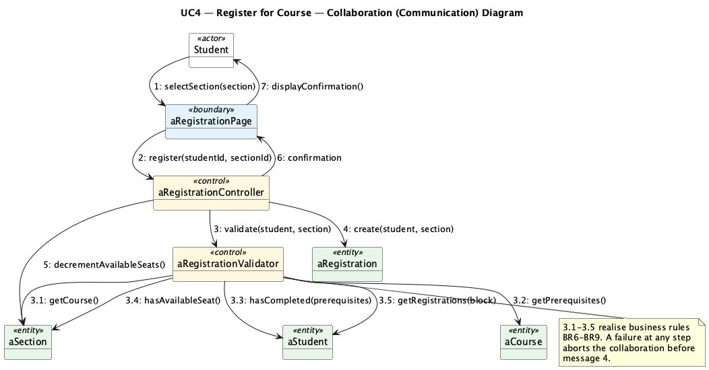
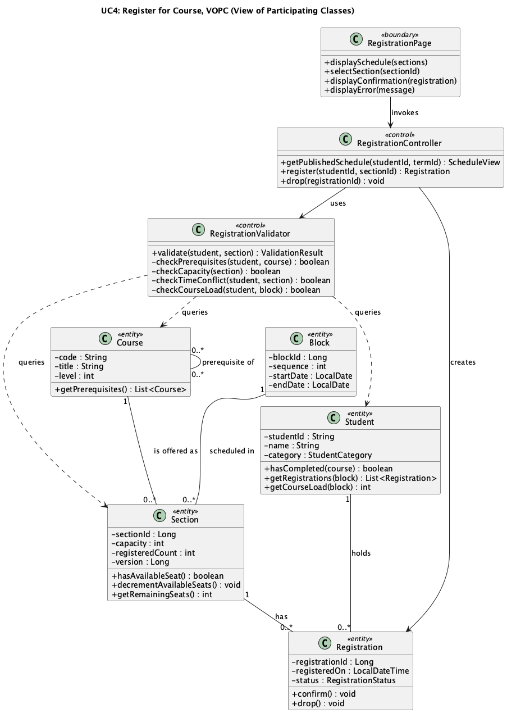

# Lab 5: Collaboration and VOPC Diagrams

**Project:** eRegistrar  
**Student:** Ziad El Fatih, 618971  

For each of the two major use cases, this lab pairs a **collaboration
(communication) diagram** (the same interaction as Lab 4, but organised around
the links between objects, with hierarchical message numbering) with a **VOPC
(View of Participating Classes)** diagram showing the analysis classes with
their attributes, operations and relationships.

---

## UC4: Register for Course

### Collaboration diagram



Messages 3.1 through 3.5 are the validation sub-messages sent by
`aRegistrationValidator` while handling message 3. If any of them fails, the
collaboration stops before message 4: no registration is created and no seat
is consumed.

### VOPC



| Class | Stereotype | Responsibility |
|---|---|---|
| `RegistrationPage` | boundary | Presents the schedule, collects the selection, shows the result. |
| `RegistrationController` | control | Coordinates the use case and owns the transaction. |
| `RegistrationValidator` | control | Prerequisites, capacity, time conflict, course load (BR6 to BR9). |
| `Student` | entity | Category, completed courses, current registrations. |
| `Section` | entity | Capacity, registered count, and `version` for optimistic locking. |
| `Course` | entity | Level and prerequisites (the reflexive "prerequisite of" association). |
| `Registration` | entity | The student-to-section association. |
| `Block` | entity | The 8-week period a section is scheduled in. |

## UC3: Generate Term Schedule

### Collaboration diagram


Messages 4.1 through 4.7 are the generation steps performed by
`aScheduleGenerator`. Message 4.5.1 is the conflict checker's query back to
`aFaculty`, which enforces BR3 and BR4.

### VOPC


| Class | Stereotype | Responsibility |
|---|---|---|
| `ScheduleGenerationPage` | boundary | Generation form and draft-schedule display. |
| `ScheduleController` | control | Coordinates generation. |
| `ScheduleGenerator` | control | Required courses, block placement, section creation, faculty selection. |
| `AssignmentConflictChecker` | control | Qualification, availability and double-booking checks. |
| `Term`, `Entry`, `Block`, `Program`, `Course`, `Faculty`, `Section`, `Schedule` | entity | The scheduling data. |

---

## How these map to the design

Control classes become business-layer services, entity classes become the
domain model and JPA entities, and boundary classes become Spring MVC
controllers with their Thymeleaf views. That's the layering set out in the
architecture document (Lab 3), and it's realised in the Lab 7 eRegistrar
application.

## Re-rendering

```bash
java -jar tools/plantuml.jar -tpng Lab5_Collaboration_VOPC/diagrams/*.puml
```
