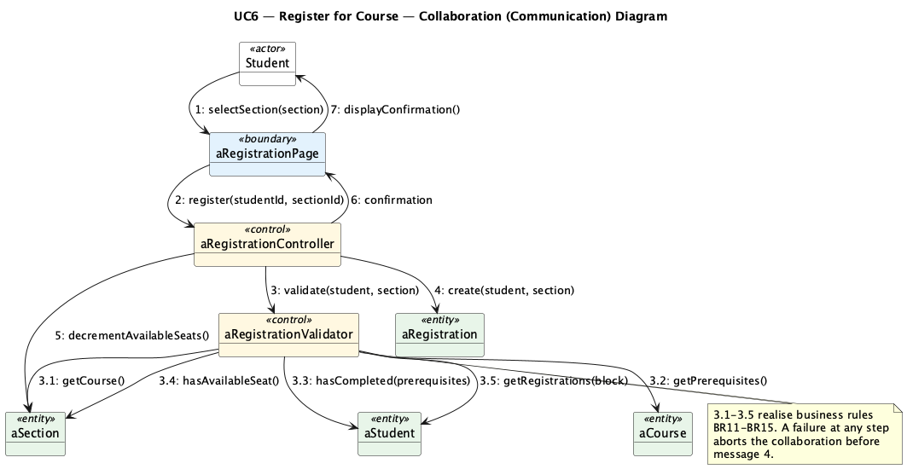
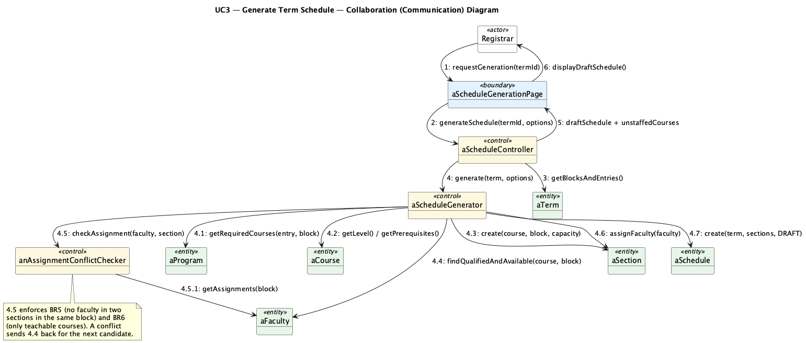
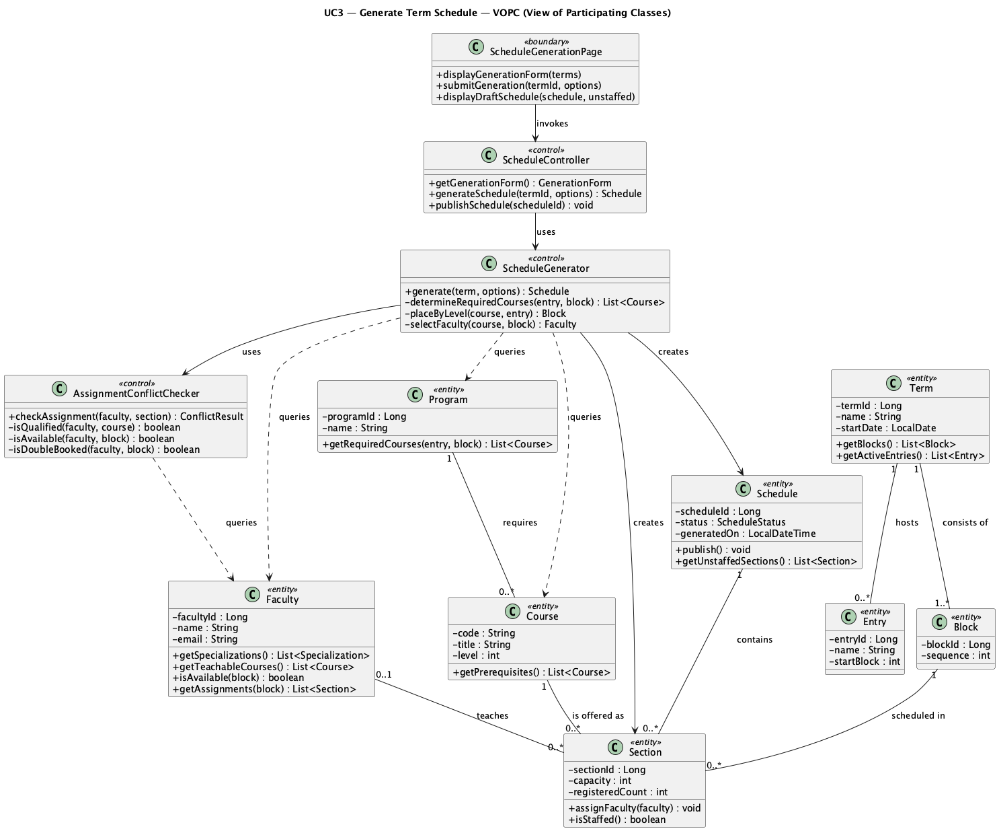
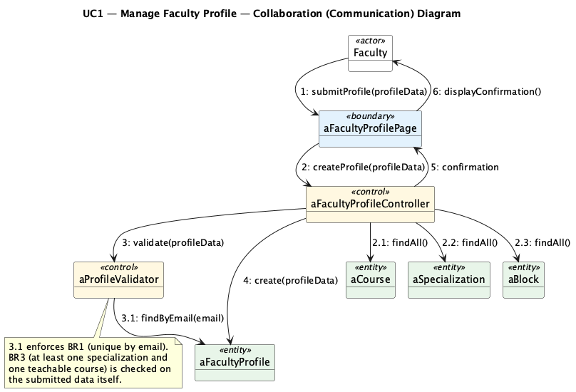
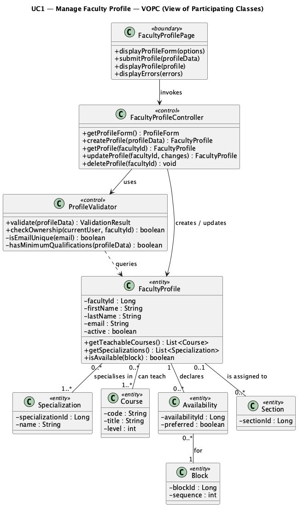

# Lab 5 — Collaboration and VOPC Diagrams

**Project:** eRegistrar
**Author:** Ziad El Fatih — 618971
**Date:** August 3, 2026

Continuing the use-case analysis of Lab 4, this lab adds, for each significant
use case, a **collaboration (communication) diagram** — the same interaction
organised around the links between objects rather than along a timeline — and a
**VOPC (View of Participating Classes)** class diagram showing the analysis
classes that participate, with their responsibilities and relationships.

Guidelines followed are those from the second half of Lesson 7 (slides 41–57):
one boundary class per actor/use-case pair, one control class per use case
(plus a separate control class where a distinct rule set justifies it), entity
classes for stored information, hierarchical message numbering on the
collaboration diagrams, and attributes/operations plus multiplicities on the
VOPC diagrams.

---

## UC6 — Register for Course

### Collaboration diagram


*Source: [collab_uc6_register_for_course.puml](diagrams/collab_uc6_register_for_course.puml)*

Message numbering shows the nesting: messages 3.1–3.5 are the validation
sub-messages sent by `aRegistrationValidator` while handling message 3. The
collaboration aborts before message 4 if any of them fails, so no registration
is created and no seat is consumed.

### VOPC


*Source: [vopc_uc6_register_for_course.puml](diagrams/vopc_uc6_register_for_course.puml)*

| Class | Stereotype | Responsibility |
|---|---|---|
| `RegistrationPage` | boundary | Presents the published schedule and remaining seats; collects the selection; shows confirmation or error. |
| `RegistrationController` | control | Coordinates the use case and owns the transaction boundary. |
| `RegistrationValidator` | control | BR11–BR15: prerequisites, capacity, time conflict, course load, duplicates. |
| `Student` | entity | Category, completed courses, current registrations, course load. |
| `Section` | entity | Capacity, registered count and `version` for optimistic locking. |
| `Course` | entity | Level and prerequisites (the reflexive "prerequisite of" association). |
| `Registration` | entity | The student-to-section association with its status. |
| `Block` | entity | The 8-week period a section is scheduled in. |

---

## UC3 — Generate Term Schedule

### Collaboration diagram


*Source: [collab_uc3_generate_schedule.puml](diagrams/collab_uc3_generate_schedule.puml)*

Messages 4.1–4.7 are the generation steps performed by `aScheduleGenerator`;
4.5.1 is the conflict checker's own query back to `aFaculty`, which is what
enforces BR5 and BR6.

### VOPC


*Source: [vopc_uc3_generate_schedule.puml](diagrams/vopc_uc3_generate_schedule.puml)*

| Class | Stereotype | Responsibility |
|---|---|---|
| `ScheduleGenerationPage` | boundary | Generation form; draft schedule and unstaffed-course display. |
| `ScheduleController` | control | Coordinates generation and publication. |
| `ScheduleGenerator` | control | Required-course determination, level-based block placement (BR7), section creation, faculty selection. |
| `AssignmentConflictChecker` | control | Qualification, availability and double-booking checks (BR5, BR6). |
| `Term`, `Entry`, `Block` | entity | Calendar structure. |
| `Program`, `Course` | entity | Program requirements and prerequisites. |
| `Faculty` | entity | Specializations, teachable courses, availability, current assignments. |
| `Section`, `Schedule` | entity | The generated offering and its draft/published state. |

---

## UC1 — Manage Faculty Profile

### Collaboration diagram


*Source: [collab_uc1_manage_faculty_profile.puml](diagrams/collab_uc1_manage_faculty_profile.puml)*

### VOPC


*Source: [vopc_uc1_manage_faculty_profile.puml](diagrams/vopc_uc1_manage_faculty_profile.puml)*

`Availability` appears as an entity in its own right rather than as an attribute
of `FacultyProfile`, because a faculty member's availability is per block and
carries its own `preferred` flag — which the scheduler uses to break ties
between otherwise equally qualified candidates.

---

## Consolidated analysis-class list

| Analysis class | Stereotype | Appears in |
|---|---|---|
| `RegistrationPage` | boundary | UC6 |
| `ScheduleGenerationPage` | boundary | UC3 |
| `FacultyProfilePage` | boundary | UC1 |
| `RegistrationController` | control | UC6 |
| `RegistrationValidator` | control | UC6 |
| `ScheduleController` | control | UC3 |
| `ScheduleGenerator` | control | UC3 |
| `AssignmentConflictChecker` | control | UC3, UC4 |
| `FacultyProfileController` | control | UC1 |
| `ProfileValidator` | control | UC1 |
| `Student` | entity | UC6 |
| `Registration` | entity | UC6 |
| `Section` | entity | UC3, UC6 |
| `Course` | entity | UC1, UC3, UC6 |
| `Block` | entity | UC1, UC3, UC6 |
| `Schedule` | entity | UC3 |
| `Term`, `Entry`, `Program` | entity | UC3 |
| `Faculty` / `FacultyProfile` | entity | UC1, UC3 |
| `Specialization`, `Availability` | entity | UC1 |

These classes are the input to class design (Lesson 14) and map directly onto
the subsystems of the [architecture document](../Lab3_Architecture/eRegistrar_Architecture.md):
control classes become business-layer services, entity classes become the
domain model and JPA entities, and boundary classes become Spring MVC
controllers with their Thymeleaf views.

## Re-rendering the diagrams

```bash
java -jar tools/plantuml.jar -tpng Lab5_Collaboration_VOPC/diagrams/*.puml
```
