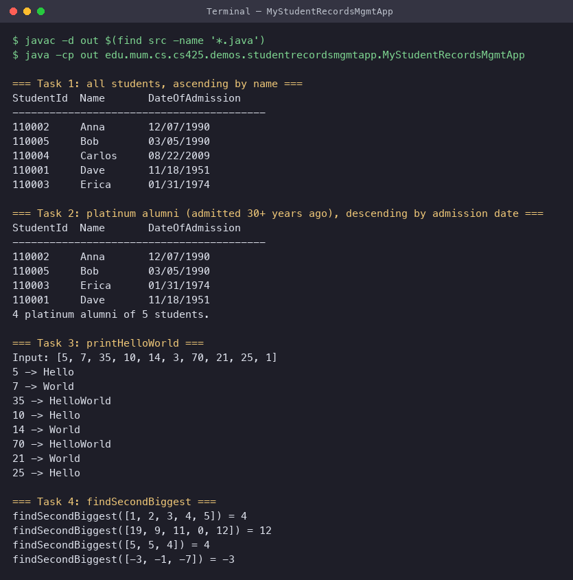

# Lab 6: Java Development Environment and Coding Practice Exercises

**Author:** Ziad El Fatih, 618971

## Environment setup

- Java SE JDK: OpenJDK 11.0.30. Evidence in [screenshots/02_jdk_and_tool_versions.png](screenshots/02_jdk_and_tool_versions.png).
- IDE: any of Eclipse for Enterprise Java, IntelliJ IDEA, or VS Code. The code is plain `javac`-compatible with no IDE-specific project files.
- Git: repository at the CS425 project root.

## Student Records Management application

Source: [StudentRecordsMgmtApp/src/](StudentRecordsMgmtApp/src/)

```
edu.mum.cs.cs425.demos.studentrecordsmgmtapp
├── MyStudentRecordsMgmtApp.java     (executable class, main)
└── model
    └── Student.java                 (the Student class)
```

`Student` has the required fields (`studentId`, `name`, `dateOfAdmission`),
three constructors, and getters/setters.

`MyStudentRecordsMgmtApp` implements:

| Method | Behaviour |
|---|---|
| `printListOfStudents(Student[])` | Prints every student in ascending order of name. |
| `getListOfPlatinumAlumniStudents(Student[])` | Returns students admitted at least 30 years ago; printed in descending order of admission date. |
| `printHelloWorld(int[])` | Prints `Hello` for multiples of 5, `World` for multiples of 7, `HelloWorld` for multiples of both. |
| `findSecondBiggest(int[])` | Returns the second biggest integer in a single pass, without sorting. |

### Building and running

```bash
cd Lab6_Java_Setup_and_Coding/StudentRecordsMgmtApp && javac -d out $(find src -name '*.java') && java -cp out edu.mum.cs.cs425.demos.studentrecordsmgmtapp.MyStudentRecordsMgmtApp
```

### Results



Raw output: [screenshots/console_output.txt](screenshots/console_output.txt).
