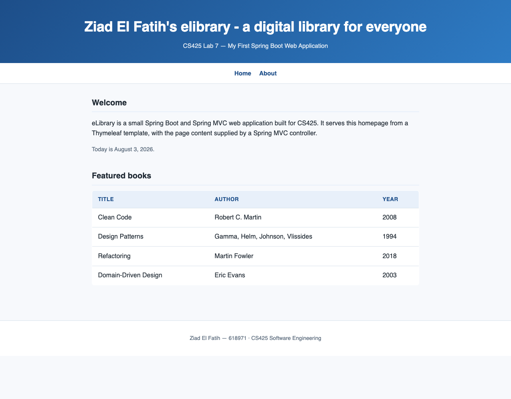
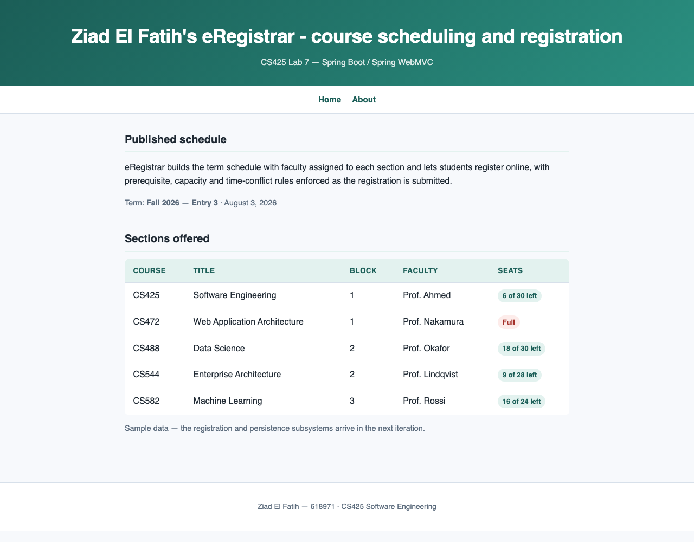

# Lab 7 — Spring Boot Web Applications

**Author:** Ziad El Fatih — 618971
**Date:** August 3, 2026

Two Spring Boot / Spring WebMVC applications: **eLibrary** (the tutorial
application, with the homepage banner renamed as the lab requires) and
**eRegistrar** (a second application built from scratch, whose content is the
course project specified in Labs 1–5).

## 1. Prerequisites — verified

| Requirement | Status |
|---|---|
| Java SE JDK | OpenJDK 11.0.30 — `java -version` output in [../Lab6_Java_Setup_and_Coding/screenshots/tool_versions.txt](../Lab6_Java_Setup_and_Coding/screenshots/tool_versions.txt) |
| Apache Maven 3.x | Maven 3.9.9. It is **not** installed system-wide; each project carries the standard **Maven Wrapper** (`mvnw`), which is the recommended per-project setup — no global install is needed to build either app. |
| IDE for Enterprise Java | Both projects are plain Maven projects and import directly into Eclipse for Enterprise Java, IntelliJ IDEA, Spring Tools Suite, or VS Code. |

### A note on versions

Spring Initializr no longer generates projects below Spring Boot 4.0, which
requires Java 17 or newer, while this machine has JDK 11. Both projects are
therefore built against **Spring Boot 2.7.18 on Java 11**, which is the current
Boot line that supports JDK 11 — the applications, the DevTools workflow and the
project layout are otherwise exactly what the tutorial describes. If you install
JDK 17 or 21 (`brew install openjdk@21`), the same source works after bumping
`<version>` and `<java.version>` in each `pom.xml`.

## 2. eLibrary

Directory: [elibrary/](elibrary/) · package `edu.mum.cs.cs425.elibrary`

| Item | Detail |
|---|---|
| Entry point | `ElibraryApplication` |
| Controller | `controller.HomeController` — serves `/`, `/index`, `/home` and `/about` |
| Templates | `src/main/resources/templates/index.html`, `about.html` (Thymeleaf) |
| Static assets | `src/main/resources/static/css/style.css` |
| Port | 8080 |
| Tests | `HomeControllerTest` — 2 tests, both passing |

**Step 3 of the lab — the renamed banner.** The homepage banner reads
*"Ziad El Fatih's elibrary - a digital library for everyone"*, set in
`HomeController.BANNER` and rendered by the Thymeleaf template. A test asserts
the name is present, so the requirement cannot silently regress.



Screenshots: [elibrary/screenshots/](elibrary/screenshots/) — `homepage.png`
and `about_page.png`, captured from the running application at
`http://localhost:8080`.

### Run it

```bash
cd Lab7_SpringBoot/elibrary && ./mvnw spring-boot:run
```

Then open <http://localhost:8080>.

## 3. eRegistrar

Directory: [eregistrar/](eregistrar/) · package `edu.mum.cs.cs425.eregistrar`

Built from scratch following the same steps, with its own content: the homepage
shows a published term schedule — course, title, block, assigned faculty and
remaining seats — which is the read-only half of use case **UC6 (Register for
Course)** from the [SRS](../Lab2_SRS/eRegistrar_SRS.md). Sections that are full
are marked as such, which is the capacity rule (BR12) made visible. The data is
static sample data at this stage; persistence and the registration transaction
belong to the next iteration.

| Item | Detail |
|---|---|
| Entry point | `EregistrarApplication` |
| Controller | `controller.HomeController` with the `Section` view model |
| Port | 8081 (so it can run alongside eLibrary) |
| Tests | `HomeControllerTest` — 2 tests, both passing |



### Run it

```bash
cd Lab7_SpringBoot/eregistrar && ./mvnw spring-boot:run
```

Then open <http://localhost:8081>.

## 4. DevTools and LiveReload

Both projects include `spring-boot-devtools` and enable it in
`application.properties`:

```properties
spring.devtools.restart.enabled=true
spring.devtools.livereload.enabled=true
spring.thymeleaf.cache=false
```

With the app started via `./mvnw spring-boot:run`, editing a Java class triggers
an automatic restart, and editing a template or CSS file is picked up on the
next refresh — with the LiveReload browser extension installed, the page
refreshes itself. Template caching is off so that view edits appear immediately.

## 5. Build and test both applications

```bash
cd Lab7_SpringBoot/elibrary && ./mvnw clean package && cd ../eregistrar && ./mvnw clean package
```

Each build runs its tests and produces an executable JAR in `target/`, runnable
with `java -jar target/<app>-0.0.1-SNAPSHOT.jar`.

## 6. Submission

- **GitHub.** The lab asks for a repository named `elibrary`. `elibrary/` is
  ready to be pushed as its own repository; the commands are in
  [../Lab2_SRS/GIT_SETUP.md](../Lab2_SRS/GIT_SETUP.md). Pushing needs your
  GitHub account, so it has been left for you to run.
- **Zip.** Produce the submission archive with:

```bash
cd Lab7_SpringBoot && zip -r elibrary.zip elibrary -x '*/target/*'
```

- Submit the zip and the repository URL in Sakai.
