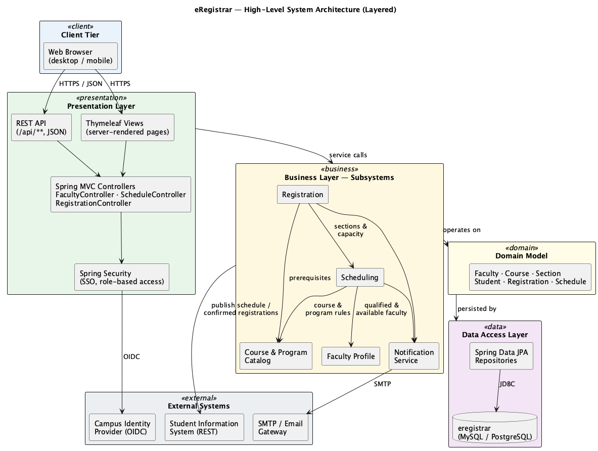
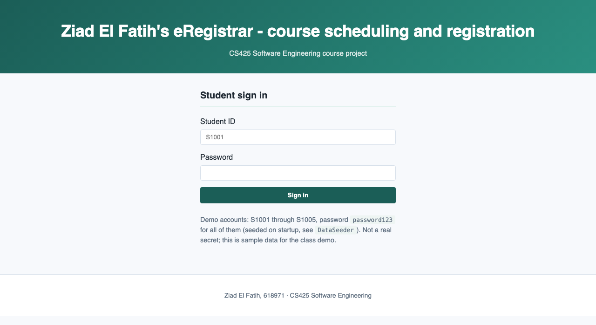
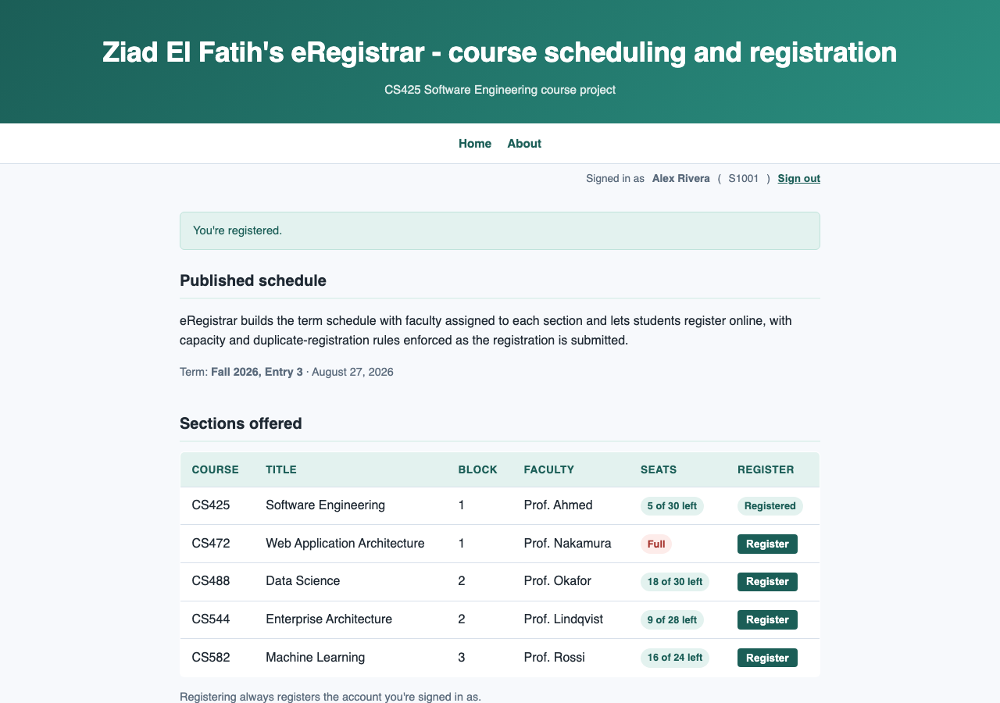
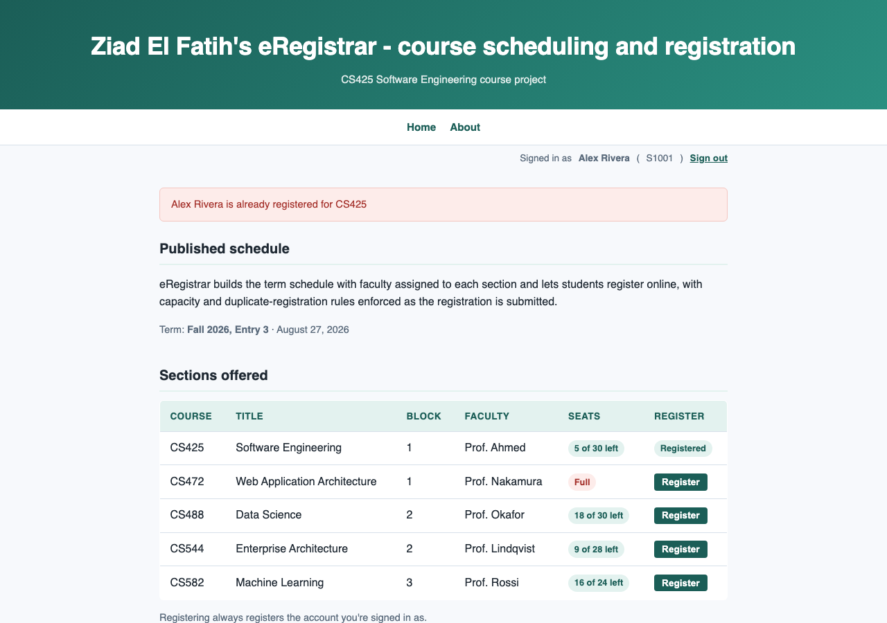

# eRegistrar

CS425 Software Engineering course project.

Ziad El Fatih, 618971

This README covers the project end to end: the problem, the requirements
analysis, the architecture and design, the implementation, and how to run
and test it. It is written to stand on its own as the project submission and
presentation material.

## Contents

1. [Project Overview](#1-project-overview)
2. [Vision](#2-vision)
3. [Requirements (SRS)](#3-requirements-srs)
4. [System Architecture](#4-system-architecture)
5. [UML Diagrams](#5-uml-diagrams)
6. [Technology Stack](#6-technology-stack)
7. [Application-Layer Structure](#7-application-layer-structure)
8. [Installation, Configuration and Execution](#8-installation-configuration-and-execution)
9. [Database Setup](#9-database-setup)
10. [Automated Tests](#10-automated-tests)
11. [Screenshots](#11-screenshots)
12. [Known Limitations and Future Improvements](#12-known-limitations-and-future-improvements)
13. [Course Lab Deliverables](#13-course-lab-deliverables)

---

## 1. Project Overview

**Problem.** Course registration in the Computer Science department is still
run on spreadsheets and email. The registrar builds each term's schedule by
hand, faculty send in their teaching preferences by email, and students
register on paper forms that staff later key into the system. That worked
when the department was small. It now runs four entries a year with 100 to
130 students per entry, and 8 or 9 electives in a busy block. Prerequisite
and capacity problems usually turn up only after students discover them,
once registration is already open.

**Purpose.** eRegistrar is a web application that builds the term schedule
with faculty assigned to each section, and lets students register online
with capacity and duplicate-registration rules enforced automatically as the
registration is submitted.

**Scope.** In scope: faculty profiles, course catalog, schedule generation,
and student registration. Out of scope: admissions, grading, tuition, and
room allocation. Those stay with the university's existing student
information system. This implementation focuses on the schedule display and
the registration transaction (UC4), the two most architecturally significant
use cases identified during analysis.

**Stakeholders.** Registrar (administrator), faculty, students, department
chair, IT administrator. Full descriptions in the [Vision Document](#2-vision).

**Features.** Faculty profile management, course catalog, schedule
generation, faculty assignment and conflict detection, online student
registration, registration rule enforcement, schedule/enrolment views,
role-based access. Full problem/need/feature table in the Vision Document.

**Assumptions and constraints.** The academic calendar (blocks, entries) is
fixed by the university; a production deployment would delegate
authentication to the campus identity provider rather than the app's own
login (this implementation uses its own login, as an extra-credit security
addition, since integrating a real identity provider is out of scope for a
course project); the system targets a Java / Spring Boot stack with a
relational database.

## 2. Vision

Full document: [Lab1_Vision/eRegistrar_Vision_Document.pdf](Lab1_Vision/eRegistrar_Vision_Document.pdf)

Covers the problem statement, product position statement, stakeholder
descriptions, the problem/need/feature table, assumptions and dependencies,
alternatives considered, and the non-functional requirements.

## 3. Requirements (SRS)

Full document: [Lab2_SRS/eRegistrar_SRS.pdf](Lab2_SRS/eRegistrar_SRS.pdf)

### Actors

| Actor | Description |
|---|---|
| Student | Registers for and drops courses; views the published schedule. |
| Faculty | Maintains their profile; views assigned sections. |
| Registrar (Administrator) | Maintains the catalog, generates and publishes the schedule, assigns faculty. |

### Use cases


| ID | Use Case | Primary Actor | Description |
|---|---|---|---|
| UC1 | Manage Faculty Profile | Faculty | Create, view and update a faculty profile. |
| UC2 | Manage Course Catalog | Registrar | CRUD for courses, prerequisites and program requirements. |
| UC3 | Generate Term Schedule | Registrar | Build a draft schedule of sections and assign qualified, available faculty. |
| UC4 | Register for Course | Student | Register for a section of a published schedule, subject to the registration rules. **Implemented end to end in this codebase.** |
| UC5 | Drop Course | Student | Drop a registration within the registration window, releasing the seat. |
| UC6 | View Schedule | Student, Faculty | View the published schedule. |

### UC4: Register for Course, use-case description

| | |
|---|---|
| Brief description | A signed-in student registers for a section of a published schedule. The system accepts the registration only if a seat is available and the student is not already registered for that section. |
| Preconditions | The student is signed in and a schedule is published. |
| Basic flow | The student selects a section and clicks Register. The system identifies the student from their session (not from a form field), checks the business rules, creates the registration, and decrements the available seats in the same transaction. |
| Alternate flows | A1 section full (rejected); A2 already registered (rejected). |
| Business rules | **BR7:** Registrations may never exceed a section's capacity. **BR-dup:** A student may not hold two active registrations for the same section. |

### Non-functional requirements

| ID | Requirement |
|---|---|
| NFR1 | Schedule and registration pages respond within 2 seconds under normal load. |
| NFR3 | Section capacity is enforced correctly under concurrent registration. |
| NFR4 | Every operation is authorized by role; a student may access only their own registrations. Implemented: every route requires sign-in, and the student registering is always taken from the authenticated session, never a form field. |
| NFR6 | The system runs on any platform with a Java 11+ runtime and a relational database. |

Full requirement set, remaining use cases, and all business rules (BR1–BR9)
are in the SRS document linked above.

## 4. System Architecture

Full document: [Lab3_Architecture/eRegistrar_Architecture.pdf](Lab3_Architecture/eRegistrar_Architecture.pdf)



A layered web architecture: Presentation, then Business (subsystems), then
Domain Model, then Data Access, with external systems behind adapters.
Dependencies point downwards only. A layered design was chosen over
microservices because it keeps a registration inside one local transaction,
which is what makes the capacity rule (BR7) enforceable without a
distributed transaction; see the architecture document for the full
comparison of alternatives considered.

## 5. UML Diagrams

Sequence, collaboration and VOPC diagrams for the two architecturally
significant use cases, UC3 (Generate Term Schedule) and UC4 (Register for
Course):

| Use case | Sequence | Collaboration | VOPC |
|---|---|---|---|
| UC3 | [diagram](Lab4_SequenceDiagrams/diagrams/sd_uc3_generate_schedule.png) | [diagram](Lab5_Collaboration_VOPC/diagrams/collab_uc3_generate_schedule.png) | [diagram](Lab5_Collaboration_VOPC/diagrams/vopc_uc3_generate_schedule.png) |
| UC4 | [diagram](Lab4_SequenceDiagrams/diagrams/sd_uc4_register_for_course.png) | [diagram](Lab5_Collaboration_VOPC/diagrams/collab_uc4_register_for_course.png) | [diagram](Lab5_Collaboration_VOPC/diagrams/vopc_uc4_register_for_course.png) |


Every lifeline is stereotyped `«boundary»`, `«control»` or `«entity»`, and
the entity classes on the VOPC diagrams map directly onto the JPA entities
in [§7](#7-application-layer-structure) below.

## 6. Technology Stack

| Layer | Technology |
|---|---|
| Language / runtime | Java 11 (OpenJDK) |
| Web framework | Spring Boot 2.7.18, Spring MVC |
| View | Thymeleaf |
| Persistence | Spring Data JPA, Hibernate |
| Database | H2 (file-based, embedded) |
| Security | Spring Security, BCrypt password hashing |
| Build | Maven, via the Maven Wrapper (`mvnw`) |
| Testing | JUnit 5, AssertJ, Spring Boot Test |

## 7. Application-Layer Structure

Source: [Lab7_SpringBoot/eregistrar/src/main/java/edu/mum/cs/cs425/eregistrar/](Lab7_SpringBoot/eregistrar/src/main/java/edu/mum/cs/cs425/eregistrar/)

```
eregistrar
├── controller
│   ├── HomeController.java          GET /, /about (renders the published schedule)
│   ├── RegistrationController.java  POST /register (UC4 write path)
│   └── LoginController.java         GET /login (custom sign-in page)
├── security
│   ├── SecurityConfig.java          route protection, BCrypt, login/logout
│   └── StudentUserDetailsService.java  loads a Student as a login principal
├── service
│   ├── ScheduleService.java         read side: published sections
│   ├── RegistrationService.java     UC4 business rules (BR7, duplicate check)
│   ├── SectionFullException.java
│   └── AlreadyRegisteredException.java
├── repository
│   ├── CourseRepository.java
│   ├── FacultyRepository.java
│   ├── BlockRepository.java
│   ├── SectionRepository.java
│   ├── StudentRepository.java
│   └── RegistrationRepository.java  (all Spring Data JPA interfaces)
├── model
│   ├── Course.java
│   ├── Faculty.java
│   ├── Block.java
│   ├── Section.java                 capacity, registeredCount, @Version
│   ├── Student.java                 studentId, name, email, passwordHash, role
│   ├── Role.java                    STUDENT, ADMIN
│   ├── Registration.java
│   └── RegistrationStatus.java
└── DataSeeder.java                  seeds sample data + hashed passwords on startup
```

**Controller layer.** `HomeController`, `RegistrationController` and
`LoginController` handle HTTP requests and view rendering only; no business
logic lives here.

**Service layer.** `RegistrationService.register()` is the one method that
implements UC4: it looks up the student and section, rejects a duplicate
registration, rejects the request if the section has no seat left, and
otherwise increments the seat count and creates the `Registration`, all in
one `@Transactional` method.

**Repository layer.** Plain Spring Data JPA repositories; no custom SQL
except one `@Query` for ordering the published schedule.

**Entity and database design.** `Section` carries a `@Version` column, so
the seat check and seat increment inside one transaction are protected by
optimistic locking: if two requests raced for the last seat, the losing
commit would fail with `OptimisticLockingFailureException` rather than
silently over-filling the section. `RegistrationController` catches that
exception and reports it to the student as a normal "section full" error.

### Security (authentication and authorization)

Every route except `/login` and static assets requires a signed-in student
(`SecurityConfig`). Passwords are never stored in plain text: `Student`
holds a BCrypt hash, and `StudentUserDetailsService` loads a student by
their `studentId` (used as the login username) for Spring Security to check
against.

Authorization is enforced structurally, not just at the login screen: the
student a registration is created for comes from the authenticated
session (`Principal.getName()` in `RegistrationController`), never from a
request parameter. A student cannot register on behalf of anyone else, no
matter what a request contains, which is exactly what NFR4 in the SRS asks
for.

## 8. Installation, Configuration and Execution

Prerequisites: JDK 11+. Maven is not required system-wide; the project
carries the Maven Wrapper.

```bash
git clone https://github.com/ElfatihZiad/eregistrar.git
cd eregistrar/Lab7_SpringBoot/eregistrar
./mvnw spring-boot:run
```

Open <http://localhost:8081>, which redirects to a sign-in page. Sample
students `S1001` through `S1005` are seeded on startup (see
[DataSeeder](Lab7_SpringBoot/eregistrar/src/main/java/edu/mum/cs/cs425/eregistrar/DataSeeder.java)),
all with the password `password123`. Sign in as one and click Register on
any open section to exercise UC4.

To build an executable JAR instead:

```bash
./mvnw clean package
java -jar target/eregistrar-0.0.1-SNAPSHOT.jar
```

## 9. Database Setup

No separate database install is required. The app uses a file-based H2
database at `Lab7_SpringBoot/eregistrar/data/eregistrar.mv.db`, created
automatically on first run (`spring.jpa.hibernate.ddl-auto=update`). Delete
that file to reset to a clean, unseeded state.

The H2 web console is available at <http://localhost:8081/h2-console> while
the app is running (JDBC URL `jdbc:h2:file:./data/eregistrar`, user `sa`, no
password (this is H2's own local-development default, not a real secret).

## 10. Automated Tests

Source: [Lab7_SpringBoot/eregistrar/src/test/java/](Lab7_SpringBoot/eregistrar/src/test/java/)

`RegistrationServiceTest` covers UC4's business rules directly against an
in-memory H2 database, isolated from the dev database:

| Test | Case |
|---|---|
| `registerSucceedsAndFillsTheSeat` | Normal case |
| `registrationIsRejectedOnceTheSectionIsFull` | Boundary case (BR7) |
| `aStudentCannotRegisterTwiceForTheSameSection` | Error case (duplicate) |
| `registeringAnUnknownStudentFails` | Error case (unknown student) |
| `droppingARegistrationFreesTheSeat` | Normal case (drop) |

`SecurityTest` covers the security extra credit: that protection is real,
not just a login page nothing enforces.

| Test | Case |
|---|---|
| `anonymousRequestToTheHomepageIsRedirectedToLogin` | An unauthenticated visitor cannot see the schedule |
| `anonymousRequestToRegisterIsRedirectedToLogin` | ...nor register, even by posting directly to the endpoint |
| `correctCredentialsLogIn` | Normal case: a seeded student's real password logs in |
| `wrongPasswordIsRejected` | Error case: a valid student ID with the wrong password fails |
| `unknownStudentIdIsRejected` | Error case: a login attempt for a student who doesn't exist fails |

`HomeControllerTest` covers the read side: the homepage renders the named
banner and lists sections with seat availability.

Run the suite:

```bash
cd Lab7_SpringBoot/eregistrar && ./mvnw test
```

Evidence all three suites pass:

```
Tests run: 2, Failures: 0, Errors: 0, Skipped: 0 - in edu.mum.cs.cs425.eregistrar.HomeControllerTest
Tests run: 5, Failures: 0, Errors: 0, Skipped: 0 - in edu.mum.cs.cs425.eregistrar.security.SecurityTest
Tests run: 5, Failures: 0, Errors: 0, Skipped: 0 - in edu.mum.cs.cs425.eregistrar.service.RegistrationServiceTest
```

## 11. Screenshots

Sign-in page. Nothing past this point is reachable without a valid student
ID and password:



Published schedule after signing in as S1001 (Alex Rivera). The userbar in
the top right shows who's signed in and a real sign-out button:


A successful registration (registering for CS425; the seat count and the
flash confirmation both come from the real transaction, not mocked data,
and the row now shows "Registered" instead of a button):



The same student attempting to register for the same section again is
rejected (BR-dup), with the seat count unchanged:



## 12. Known Limitations and Future Improvements

- **The app has its own login instead of a real identity provider.** This is
  intentional for a course project (the architecture document specifies the
  campus identity provider for a production deployment); the login here is
  a real, working Spring Security setup with hashed passwords, just not
  federated to an external provider.
- **Only one role is actually exercised.** `Role.ADMIN` exists on the
  `Student` entity and in `StudentUserDetailsService`'s granted authorities,
  but no admin-only screen has been built yet to make use of it.
- **Only UC4 (Register for Course) is wired to persistence end to end.** UC1
  through UC3, UC5 and UC6 are modelled in the SRS/architecture/diagrams but
  are not yet backed by working screens; UC3 (Generate Term Schedule) is the
  next candidate, since its analysis and design are already complete.
- **Business rules BR6, BR8 and BR9** (prerequisites, time conflicts, course
  load limits) are documented in the SRS but not enforced by
  `RegistrationService` yet. Only BR7 (capacity) and the duplicate-
  registration check are implemented.
- **No database migrations.** Schema is created with
  `spring.jpa.hibernate.ddl-auto=update`, which is fine for a course project
  but not for a real deployment; the architecture document specifies Flyway
  for that.
- **No cloud deployment.** The app runs locally only; that extra-credit item
  was not attempted, given the time available.

## 13. Course Lab Deliverables

| Lab | Deliverable | Folder |
|---|---|---|
| 1 | Vision Document | [Lab1_Vision/](Lab1_Vision/) |
| 2 | SRS: use-case diagram, use cases, NFRs | [Lab2_SRS/](Lab2_SRS/) |
| 3 | System architecture | [Lab3_Architecture/](Lab3_Architecture/) |
| 4 | Sequence diagrams | [Lab4_SequenceDiagrams/](Lab4_SequenceDiagrams/) |
| 5 | Collaboration and VOPC diagrams | [Lab5_Collaboration_VOPC/](Lab5_Collaboration_VOPC/) |
| 6 | Java coding exercises | [Lab6_Java_Setup_and_Coding/](Lab6_Java_Setup_and_Coding/) |
| 7 | eLibrary and eRegistrar Spring Boot applications | [Lab7_SpringBoot/](Lab7_SpringBoot/) |
